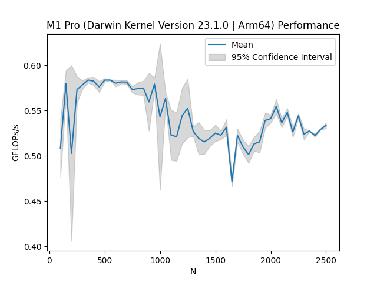

# Project 1 Write Up

## Table for Warm-up

| Kernel | Arithmetic Intensity |
| :---   | :---:                |
| Y[j] += Y[j] + A[j][i] * B[i] | **3/32 flops/byte** (3/4 flops = 3 loads, 1 store, 3 operations) |
| s += A[i] * A[i] | **1/4 flops/byte** (2 flops = 1 load, 2 operations) |
| s += A[i] * B[i] | **1/8 flops/byte** (1 flop = 2 loads, 2 operations) |
| Y[i] = A[i] + C*B[i] | **1/12 flops/byte** (2/3 flops = 2 loads, 1 store, 2 operations) |

## Part 1: Matrix-matrix Multiplication

In this first part of the project, you will test the performance of the basic matrix-matrix multiplication operation as a function of matrix size on multiple compute platforms. Complete the following using at least two different compute architectures (e.g., your laptop and HPCC, or two different node architectures on HPCC).

1. With your group, write a program that multiplies two matrices together (see: <http://mathworld.wolfram.com/MatrixMultiplication.html>). Use GitHub to manage the code development and version history.
    Done!

2. For a given matrix size _N_, what is the total number of floating point operations performed by this operator?
    For two matrices of size N, the total number of operations that occurs is roughly 2N^3 - N^2. In the statement matrix_c[idx][idy] += matrix_a[idx][idz] _matrix_b[idz][idy], there are N multiplications and N-1 additions for each element in matrix_c. The resulting matrix_c has N^2 total elements. Therefore, there are N^2_ (N + (N-1)) total flops. Therefore, there are 2N^3 - N^2 total flops for matrix multiplication.

3. Using the supplied C routine `get_walltime.c`, or any other accurate means of measuring time, compute the performance in Mflop/s of the matrix-matrix multiply for _N_=100\. Be sure to perform enough repeat calculations of the timing to overcome any statistical noise in the measurement.

     By definition, the peak perforance is the multiplication of clock speed, number of cores, and the number of independent FPUs (1 for this example).

    | Computer            | MFlops/s (avg over 3 trials) | Processor Clock Speed (GHz) | L1 cache size | L2 cache size | L3 cache size | Number of cores | Peak Performance (Gflops/s) |
    |---------------------|------------------------------|-----------------------------|---------------|---------------|---------------|-----------------|-----------------------------|
    | Berk's Laptop (Mac M1 Pro)      |            432.633           |             2.3             |      3.2 MB   |    12.58 MB   |      0    MB  |      8p 2e      |              29.64          |
    | HPCC (dev-indel18)  |            688.264                  |             3.2             |      32 KB    |     1024 KB   |     28160 KB  |       20        |               48.0          |

    Cache sizes for M1 Mac were acquired from `sysctl` command.

    On Berk's laptop:
        Trial 1: 407.036204 Mflops/s
        Trial 2: 437.458782 Mflops/s
        Trial 3: 453.406243 Mflops/s

    Peak performance = 8 performance cores _3.2 GHz_ + 2 efficiency cores _2.02_ 1 FPU = 29.64 GFlops/s

4. For the system you are running on, determine the clock speed of the processor and the cache size/layout. Use this information to estimate the theoretical peak performance of the system, assuming that the processor is capable of one flop per clock cycle (generally NOT true on modern architectures). How does the performance you measured in (3) compare to the theoretical peak performance of your system?
    Please see graph above.
5. Now repeat the performance measurement for a range of matrix size `N` from 1 to 10,000,000. Make a plot of the resulting measured Gflop/s vs. `N`. On this plot place a horizontal line representing the theoretical peak performance based upon your system's clock speed.
    
    
    
    #Need horizontal line for hpcc

    Notice that the performance of the Mac M1 Pro dis radically than the performance of the HPCC. This is due to the unique architechture of the M1 compared to the HPCC and non-M1 computers. Since Apple designed a chip that integrates CPU, GPU, Neural Engine, I/O onto one chip, it is able to have sustained performance wheras the HPCC has steeper decline in performance. Another possible explaination could be the implementation of SIMD (single insruction multile data) because it's built into the the M1 chip. Also, the M1 has fused multiply-add instructions (FMA) which saves time and gives better run times. Source for M1 information (<https://eclecticlight.co/2021/08/06/accelerating-the-m1-mac-an-introduction-to-simd/>, <https://www.apple.com/macbook-air-m1/>).
     It may also be the Apple Matrix CoProcessor showing its power. This coprocessor, included in the M1 SoC, is designed to accelerate operations like matrix multiplication. Together with the unified memory architecture, the integration of specialized hardware may contribute to more consistent performance. Source
(<https://github.com/corsix/amx/tree/main>)
    In the figures for M1 above, you can see the performance difference for using 2D arrays in comparison to 1D offset arrays. Using 1D array for matrix multiplication eliminated the performance dip we were experiencing around N = 2000.

7. How does the measured performance for multiple _N_'s compare to peak? Are there any "features" in your plot? Explain them in the context of the hardware architecture of your system. Include in your write-up a description of your system's architecture (processor, cache, etc.).

    M1 Pro: 8 Performance Cores (3.2 Ghz) + 2 Efficieny cores (2.02 Ghz). During matrix multiplication, CPU utilization never reached above 40% on efficiency cores while other programs running in the background. There is a dip in the performance at N = 1950, 2000. This may be due to the cache memory limitations.
    #TODO: Finish this problem -> Chaaran Berk answer together

To your project git repo, commit your code for performing the matrix-matrix multiply performance measurements, the plots of your results, and a brief write-up (in plain text or markdown) addressing the above questions and discussing your results. Pay particular attention to the comparison between different architectures and give explanations for them.

## Part 2: The Roofline Model

3. Run the ERT in serial mode on your local machine. Report the peak performances and bandwidths (for all caches levels as well as DRAM). Where is the "ridge point" of the roofline for the various cases?

| Architecture   | L1 Bandwidth (GB/s) | L1 Peak Performance (GFLOPs/s) | L2 Bandwidth (GB/s) | L2 Peak Performance (GFLOPS/s) | L3 Bandwidth (GB/s) | L3 Peak Performance (GFLOPS/s) | DRAM Bandwidth (GB/s) | DRAM Peak Performance (GFLOPS/s) | Ridge Point                                  |
| -------------- | ------------------- | ------------------------------- | ------------------- | ------------------------------- | ------------------- | ------------------------------- | --------------------- | ----------------------------- | -------------------------------------------- |
| Berk's Laptop (Mac M1 Pro)  | 164.6               | 32.92                           | 0.0                 | 0.0                           | 0.0                 | 0.0                           | 109.6               | 32.88                         | L1 Ridge Point: 0.2 DRAM Ridge Point: 0.3     |
| HPCC (dev-indel18)          | 53.9                | 11.32                           | 37.6                | 11.32                         | 0.0                 | 0.0                           | 20.7                | 10.35                         | L1 Ridge Point: 0.21 L2 Ridge Point: 0.31 DRAM Ridge Point: 0.6 |

In response below, obtained by running on the HPCC (See roofline.png) and Berk's personal laptop (See ERT_GRAPH_m1.png)

Notice that there is no L3 cache listed on the roofline model for the HPCC. That is because the software has a difficult time distingishing the memory allocation of DRAM and L3. Therefore, the software treats L3 and DRAM as equivalent. The same is true for the M1 pro. Since the software shows that the L2 is indistinguishable from L1 and DRAM, it grouped L2 into DRAM which and did not label L2 on the roofline model graph.
Additionally, the peak performance for the HPCC is different by a factor of four when compared to the calculated and computed values. This is due to GNUplot not vectorizing our program. Since there are four threads per core on dev node 18, our program was running on only one thread which makes our peak performance off by a factor of four.

4. Consider the four FP kernels in "Roofline: An Insightful Visual Performance Model for Floating-Point Programs and Multicore Architectures" (see their Table 2). Assuming the high end of operational (i.e., "arithmetic") intensity, how would these kernels perform on the platforms you are testing? What optimization strategy would you recommend to increase performance of these kernels?

    Information for answers to this question were found in <https://crd.lbl.gov/assets/pubs_presos/parlab08-roofline-talk.pdf>.

    SpMV: Relatively low arithmetic intensity (0.17 to 0.25 OI). It will be memory bound, so it won't reach the peak performance since there is irregular memory access to the source vector which makes it difficult to load. There is also a very low arithmetic intnesity (less than 0.166 flops/byte) which most likely leads to memory bound. An optimization strategy that we would recommend would be matrix compression with register blocking, as that would improve the flop:byte ratio of this kernel. The operational intensity varies from 0.17 (before block optimization) to 0.25 Flops/byte afterwards (see eec berkely ardicle posted on project directions). Additionally, bandwith limits performance, so using smaller data structures (16-bit vs. 32-bit index) and smaller for non-zero subblocks. SpMV is bound by L2 cache (37.6 GB/s) on the HPCC and SpMV is bandwidth bound on Berk's computer (109.6 GB/s). Therefore, SpMC is performing better on Berk's computer.

    LBMHD: (0.70 to 1.07 OI) The roofline model for LBMHD requires huge datasets and contains more additions than multiplications which causes random access to memory. Like the SpMV, this model gets a small fraction of peak performance on uniprocessor because of the complex data structure and irregularity of memory access patterns. With the high conflict misses, vectorizing the code eliminates capacity misses. An optimization strategy that we would recommend is explicit SIMDization and cache bypass using the instruction movntpd, as this will increase the flop:byte ratio to ~1.0 on x86/Cell (compared to 0.7 flop:byte without). Additonally, the no-allocate store optimization rases intensity to 1.07. LBMHD is memory bound to DRAM  on the HPCC at 20.7 GB/s and memory bound on Berk's computer at 109.6 GB/s. Therefore, LBMHD will run faster on Berk's computer

    Stencil: (0.33 to 0.5 OI) Jacobi method, must read every point from DRAM, perform 8 flops, and then write every point back to DRAM. Cache locality is the most important factor when it comes to performance of the Stencil kernel. Performs at just over 0.5 flops/byte ideally, which is achieved by optimizing using SIMDization and cache bypass. Stencil can also be optimized to a 1/3 flop:byte ratio using cache blocking, which we also recommend. Given stencil's dependency on DRAM, we can look the roofline model graphs above for both Berk's laptop and the HPCC. Since stencil is DRAM bound on the HPCC at 20.7 GB/s and DRAM bound on Berk's computer at 109.6 GB/s, stencil will run faster on Berk's computer compared to the HPCC.

    3-D FFT: (1.09 to 1.64 OI) Rather high operational intensity. It will be compute bound, so the performance will be limited by the stength of computation of the system. Optimization of computation leads to better performance, so in additon to SIMDization and cache bypass, we would also recommend unrolling loops. 3-D FFT is a compute bound kernel, so it will run on the system with the better computation power. Looking at the roofline models, 3-D FFT will run faster on Berk's laptop because FFT is DRAM bound on the HPCC at 20.7 GB/s and DRAM bound on Berk's computer at 109.6 GB/s, stencil will run faster on Berk's computer compared to the HPCC.

5. Address the same questions in (4) for the four kernels given in the Warm-up above.

    Questions from problem 4: Assuming the high end of operational (i.e., "arithmetic") intensity, how would these kernels perform on the platforms you are testing? What optimization strategy would you recommend to increase performance of these kernels?

    | Warmup Prompt | Answers to questions in problem 4 |
    | :---   | :---:                |
    | Y[j] += Y[j] + A[j][i] _B[i] **3/32 flops/byte** (3/4 flops = 3 loads, 1 store, 3 operations) | This kernel is computationaly taxing compared to the others in this problem. This kernel will be fetching information from DRAM because it will have many cache misses due to loading matrix Y, A, and B. Therefore, many operations will be loading from DRAM. Referencing the roofline model, this kernel is running at 9 GFLOPS/s on Berk's computer whereas it is running at 2 GFLOPS/s on the HPCC. Therefore, this kernel will run faster on Berk's computer than the HPCC. A optimization method for this kernel could be blocking parts of matrix A and vector B such that there are limited cache misses. Since the cache memory will be filled quickly due to fetching the rows and columns of the Y, A, and B, memory effeciency could be limited. Therefore, explicit SIMDization and cache bypass using the instruction movntpd could be a viable means of optimization. |
    |s += A[i]_ A[i]  **1/4 flops/byte** (2 flops = 1 load, 2 operations) | Referencing the roofline plots for Berk's personal laptop, this kernel would be running at peak performance (33.1 GLOPS/s) because matrix A would not be written back to memory and scalar s would stored in the registers. Therefore, this kernel would be bandwith bound rather than memory bound. Referencing the roofline model for the HPCC, this model would be running between 5-10 GFLOPS/s depending on when the cache misses occur in the runtime of the kernel. Therefore this model would have better performance on Berk's laptop. In terms of optimization, the processing of this kernel could get faster based on the hardware that is used because it would mostly be compute bound. |
    | s += A[i] * B[i] **1/8 flops/byte** (1 flop = 2 loads, 2 operations) | This example is very similar to the previous example with one extra load for the B vector in play. So, looking at the roofline model for Berk's laptop, this kernel would also be running at peak performance (33.1 GFLOPS/s) because the vectors A and B are not written back to memory and the scalar s would be stored in the registers, making this kernel bandwidth bound instead of memory bound. However, when it comes to this kernel's performance based on the roofline model for the HPCC, we run into the same issues with cache misses that we ran into in the previous example with the added problem that we now have the potential for two separate cache misses to occur with two separate vectors being indexed into. Given that this model is performing the same on Berk's laptop but worse on the HPCC, it's safe to assume that this model will once again have better performance on Berk's laptop. Once again, in terms of optimization, the processing of this kernel could get faster based on hardware since this kernel is mostly compute bound. We can also recommend blocking parts of vector A and B so that there are limited cache misses, just like in the first kernel for the warmup. |
    | Y[i] = A[i] + C*B[i] **1/12 flops/byte** (2/3 flops = 2 loads, 1 store, 2 operations) | This kernel is similar to the first kernel in the warmup because the kernel is computationaly taxing with multiple loads of vectors A and B as well as a store of vector Y. This kernel will have many cache misses due to having to load vectors A and B, but not as much as the first warmup kernel. If we are to assume that most of these loads will be done from DRAM due to the amount of cache misses, then we can also assume that many operations will be loading from DRAM. This allows us to draw the same conclusion that this kernel will run faster on Berk's laptop than the HPCC due to the results that we've seen in the roofline model and mentioned in the first kernel of the warmup above. As for optimization strategies, we'd once again recommend blocking parts of vectors A and B to limit cache misses. This would also entail explicit SIMDization and cache bypass use the instruction movntpd to deal with quickly filled cache memory and small memory efficiency. |

6. Compare your results for the roofline model to what you obtained for the matrix-matrix multiplication operation from Part 1. How are the rooflines of memory bandwidth related to the features in the algorithmic performance as a function of matrix size?
    While running the matrix multiplication with M1, we noticed a sudden drop in performance around N = 2000. However, this problem was resolved when we switched our memory allocation for the matrices from 2D arrays to offset based 1D arrays. We predict that during the 2D array allocation, since the child arrays inside the matrices can be placed at the different parts of the memory, some parts of the array may be stored in DRAM which causes the drop. During the 1D array allocation run, we did not observe the same problem this can be cause because memory allocation of this array is done linearly, this way all parts of the matrices are in the same memory partition.
    #TODO Finish this problem
    #Talk over slack when this is done

To your project write-up, add your plots of the roofline model for the systems you tested, and responses addressing the above questions.
